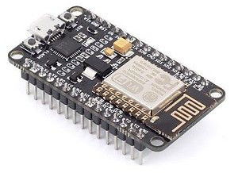

# Lua-garden


A solar-powered environmental data collector, based on ESP8266 SoC. Results are uploaded
to a [ThinkSpeak](https://thingspeak.com/) channel.



## Bill of Materials

* [ESP8266 module](http://www.ebay.co.uk/itm/1PCS-NodeMcu-Lua-WIFI-Internet-of-Things-development-board-based-ESP8266-module/191737348230) - £2.71
* [TSL2561 Lux sensor](http://www.ebay.co.uk/itm/262905196196) - £1.38
* [BME280 Temp, humidity and pressure sensor](https://www.aliexpress.com/item/GY-BME280-3-3-precision-altimeter-atmospheric-pressure-BME280-sensor-module/32711703783.html) - £2.49
* [ADS11115 Analogue-digital converter](https://www.aliexpress.com/item/16-Bit-I2C-4-CH-ADS1115-ADS1015-Module-ADC-Development-Board/32761329492.html) - £1.52
* [Rain sensor](https://www.aliexpress.com/item/1set-lot-Snow-Raindrops-Detection-Sensor-Module-Rain-Weather-Module-Humidity-For-Arduino/32711871234.html) - £0.43
* [Soil hygrometer](http://www.ebay.co.uk/itm/3PCS-Soil-Hygrometer-Detection-Module-Soil-Moisture-Sensor-For-arduino-Smart-car-/311732225358) - £1.38
* [Solar LiPo charger](https://www.aliexpress.com/item/Elecrow-Mini-Solar-Lipo-Charger-Board-CN3065-Lithium-Battery-Charge-Chip-DIY-Outdoor-Application-Kit-Charging/32808069239.html) - £2.71
* [3.7V 1000Mah LiPo battery](https://www.aliexpress.com/item/Upgrade-RC-Part-7-4V-650mAh-Lipo-Battery-H8C-10-650-for-JJRC-H8C-DFD-F183/32459323188.html) - £3.86
* [6V 1W Solar panel](https://www.aliexpress.com/item/Mini-6V-1W-Solar-Power-Panel-Solar-System-Module-DIY-For-Cell-Phone-Chargers/32763434119.html) - £0.84

## NodeMCU pinouts


## ThinkSpeak Setup

Create an account on [thinkspeak.com](https://thingspeak.com/users/sign_up).

Then create a channel with the following fields in order:
* System Voltage (Vdd)
* Temperature (°C)
* Humidity (% rH)
* Pressure (hPa)
* Lux (lx)

Make a note of the channel ID and the 'Write API key' (this will be required later).

## Tools

Install [esptool](https://github.com/espressif/esptool) _(A Python-based, open
source, platform independent, utility to communicate with the ROM bootloader
in Espressif ESP8266)_ and [nodemcu-uploader](https://github.com/kmpm/nodemcu-uploader)
_(A simple tool for uploading files to the filesystem of an ESP8266 running
NodeMCU as well as some other useful commands)_.

    $ sudo -H pip install esptool nodemcu-uploader wrapt

### macOS

For macOS host, install the [CH340G driver](drivers/CH34x) before proceeding.
A reboot will be required. Plugging in the ESP8266, and it should
appear as a device as **/dev/tty.wchusbserial1410**.

### Ubuntu

Support for the CH34x chipset is already built into the kernel, so you
should see `dmesg` report the following when plugged in:

```
[ 5567.136984] usb 3-6: new full-speed USB device number 11 using xhci_hcd
[ 5567.278374] usb 3-6: New USB device found, idVendor=1a86, idProduct=7523
[ 5567.278379] usb 3-6: New USB device strings: Mfr=0, Product=2, SerialNumber=0
[ 5567.278382] usb 3-6: Product: USB2.0-Serial
[ 5567.313372] usbcore: registered new interface driver usbserial
[ 5567.313409] usbcore: registered new interface driver usbserial_generic
[ 5567.313439] usbserial: USB Serial support registered for generic
[ 5567.315328] usbcore: registered new interface driver ch341
[ 5567.315347] usbserial: USB Serial support registered for ch341-uart
[ 5567.315366] ch341 3-6:1.0: ch341-uart converter detected
[ 5567.315905] usb 3-6: ch341-uart converter now attached to ttyUSB0
```

The device will appear as **/dev/ttyUSB0**, however it has group permissions of
'dialout', so run the following at the command line:

    $ sudo usermod -a -G dialout <YOUR_USER_ID>

Log out and restart your session.

## Firmware

[nodemcu-build.com](https://nodemcu-build.com) was used to build the firmware against the master branch and
includes the following modules: adc, ads1115, bme280, file, gpio, http, i2c,
net, node, sjson, tmr, tsl2561, uart, wifi.

Upload the firmware with (substituting the correct USB device name):

    $ esptool.py --port /dev/tty.wchusbserial1410 write_flash -fm dio 0x00000 firmware/nodemcu-float.bin
    esptool.py v1.3
    Connecting....
    Auto-detected Flash size: 32m
    Running Cesanta flasher stub...
    Flash params set to 0x0240
    Wrote 434176 bytes at 0x0 in 37.7 seconds (92.2 kbit/s)...
    Leaving...

## Pinouts

* D0 (GPIO16) <--> RST (to enable the wakeup from deep sleep)
* D3 (GPIO0) <--> I2C SDA (data)
* D4 (GPIO2) <--> I2C SCL (clock)
* 3V <--> Vdd (power)
* GND <--> GND (ground)

Add 4.7K (or 10L) pull-up resistors to 3V3 on the SDA and SCL pins.

## Uploading code

First, create a file called _src/credentials.lua_ with the following content:

```lua
SSID = "Your WiFi Access Points SSID"
WIFI_PASSWORD = "Your access point password"
THINGSPEAK_API_KEY = "Your ThingSpeak Write API key"
```

If present in the root file system, the `init.lua` file will execute first.
Upload it with:

    $ cd src
    $ nodemcu-uploader --port /dev/tty.wchusbserial1410 upload *.lua
    opening port /dev/tty.wchusbserial1410 with 115200 baud
    Preparing esp for transfer.
    Transferring credentials.lua as credentials.lua
    Transferring init.lua as init.lua
    All done!

## Connecting using `screen`

Connect to nodemcu using:

    $ screen /dev/tty.wchusbserial1410 115200

Hit the reset button, and you should see console messages displayed to the
terminal as follows:

    NodeMCU custom build by frightanic.com
            branch: master
            commit: c8ac5cfb912ff206b03dd7c60ffbb2dafb83fe5e
            SSL: false
            modules: adc,ads1115,bme280,file,gpio,http,i2c,net,node,sjson,tmr,tsl2561,uart,wifi
     build  built on: 2017-06-24 17:51
     powered by Lua 5.1.4 on SDK 2.1.0(116b762)
    Connecting to WiFi access point...
    Connection to AP(XXXX-XXX-XXX) established!
    Waiting for IP address...
    Wifi connection is ready! IP address is: 192.168.1.110
    Startup will resume momentarily, you have 3 seconds to abort.
    Waiting...
    Running
    System voltage (mV):    2984
    >

To exit out of screen, press `CTRL-A-\`. Occasionally the terminal may go insane after
using screen, so reset the terminal with:

```
$ stty sane
```

## References

* http://espressif.com/sites/default/files/documentation/0a-esp8266ex_datasheet_en.pdf
* http://nodemcu.readthedocs.io/en/master/
* https://learn.adafruit.com/adafruit-huzzah-esp8266-breakout/using-nodemcu-lua
* https://blog.sengotta.net/signed-mac-os-driver-for-winchiphead-ch340-serial-bridge/
* https://github.com/espressif/esptool
* https://github.com/kmpm/nodemcu-uploader
* https://www.thingspeak.com

## License

### The MIT License

Copyright (c) 2017 Richard Hull

Permission is hereby granted, free of charge, to any person obtaining a copy
of this software and associated documentation files (the "Software"), to deal
in the Software without restriction, including without limitation the rights
to use, copy, modify, merge, publish, distribute, sublicense, and/or sell
copies of the Software, and to permit persons to whom the Software is
furnished to do so, subject to the following conditions:

The above copyright notice and this permission notice shall be included in all
copies or substantial portions of the Software.

THE SOFTWARE IS PROVIDED "AS IS", WITHOUT WARRANTY OF ANY KIND, EXPRESS OR
IMPLIED, INCLUDING BUT NOT LIMITED TO THE WARRANTIES OF MERCHANTABILITY,
FITNESS FOR A PARTICULAR PURPOSE AND NONINFRINGEMENT. IN NO EVENT SHALL THE
AUTHORS OR COPYRIGHT HOLDERS BE LIABLE FOR ANY CLAIM, DAMAGES OR OTHER
LIABILITY, WHETHER IN AN ACTION OF CONTRACT, TORT OR OTHERWISE, ARISING FROM,
OUT OF OR IN CONNECTION WITH THE SOFTWARE OR THE USE OR OTHER DEALINGS IN THE
SOFTWARE.
